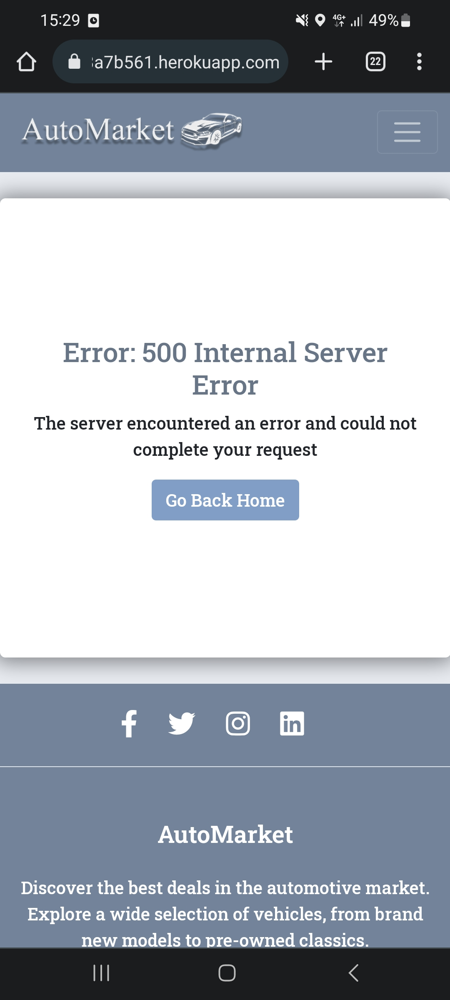
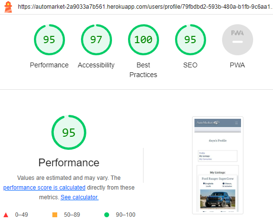
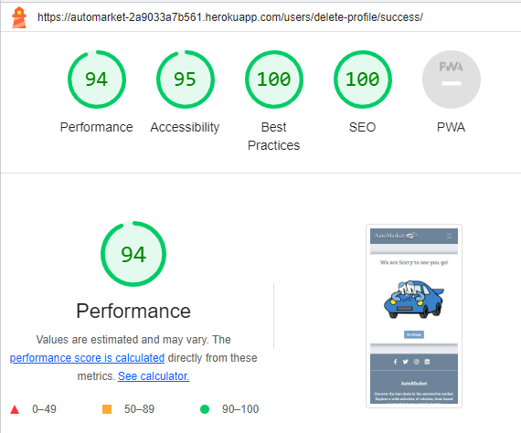
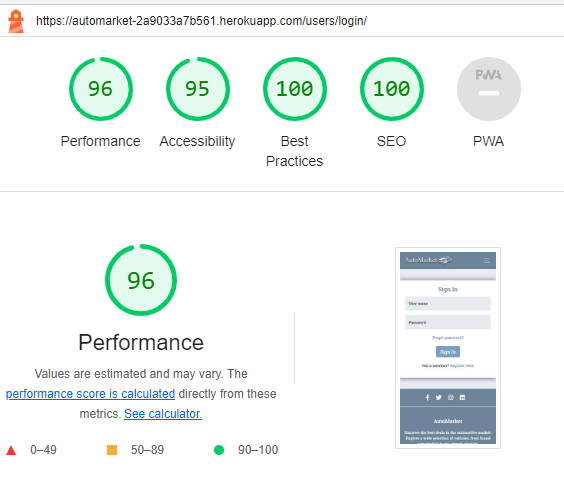

Go back to [README.md](/README.md)

# Testing
- [Code Validation](#code-validation)
    - [HTML](#html)
    - [CSS](#css)
    - [JavaScript](#JavaScript)
    - [Python](#python)
- [Responsiveness](#Responsiveness)
- [Browser Compatibility](#browser-compatibility)
- [Lighthouse](#Lighthouse)
- [Manual Testing](#manual-testing)
- [User Story Testing](#user-story-testing)

## Code Validation
### HTML
|Page|Validator|Result|
| --- | --- | --- |
| Home | | <mark>PASS<mark> |
| Listings | | <mark>PASS<mark> |
| Single Listing | | <mark>PASS<mark> |
| Create And Edit Listing | | <mark>PASS<mark> |
| My Profile | | <mark>PASS<mark> |
| My Listings | | <mark>PASS<mark> |
| My Favourites | | <mark>PASS<mark> |
| User Account | | <mark>PASS<mark> |
| User Listings | | <mark>PASS<mark> |
| Edit Profile | | <mark>PASS<mark> |
| Delete Profile Conf| | <mark>PASS<mark> |
| Profile Deleted | | <mark>PASS<mark> |
| Delete Listing Conf | | <mark>PASS<mark> |
| Remove Favourite | | <mark>PASS<mark> |
| Log In | | <mark>PASS<mark> |
| Sign Up | | <mark>PASS<mark> |
| Sign Out Conf | | <mark>PASS<mark> |
| Reset Password Enter email | | <mark>PASS<mark> |
| Reset Password email sent | | <mark>PASS<mark> |
| Reset Password Enter password | | <mark>PASS<mark> |
| Reset Password Complete | | <mark>PASS<mark> |
| Error pages | | <mark>PASS<mark> |

### CSS
Test Results CSS  <mark>PASS<mark> 

### JavaScript
1. listing_form.js <mark>PASS<mark> 

2. search.js <mark>PASS<mark>

The initial test showed variable not declared. This was fixed.

### Python
1. Api app
- serializers.py <mark>PASS<mark>

- urls.py <mark>PASS<mark>

- views.py <mark>PASS<mark>

2. Automarket app
- settings.py <mark>PASS<mark> 

(line too long is part of django standart settings file)

- urls.py <mark>PASS<mark>

- views.py <mark>PASS<mark>

3. Listings
- admin.py <mark>PASS<mark>

- cars.py <mark>PASS<mark>

- choices.py <mark>PASS<mark>

- forms.py <mark>PASS<mark>

- models.py <mark>PASS<mark>

- urls.py <mark>PASS<mark>

- url_helpers.py <mark>PASS<mark>

- utils.py <mark>PASS<mark>

- views.py <mark>PASS<mark>

4. Users
- admin.py <mark>PASS<mark>

- apps.py <mark>PASS<mark>

- emails.py <mark>PASS<mark> 

(there is a warning for line too long, however if amended the email sent to the user does not display correct. This is a string and does not affect the code.)

- forms.py <mark>PASS<mark>

- models.py <mark>PASS<mark>

- urls.py <mark>PASS<mark>

- signals.py <mark>PASS<mark>

- views.py <mark>PASS<mark>

## Responsiveness
During development each page was tested using dev tools in Google Chrome. The strategy involved ensuring that every page would adapt to various screen sizes beyond a width of 320px, as opposed to relying on fixed device-specific widths.
Further testing was done on mobile to confirm all is working as expected.

|Device|Screen Size|Pass/Fail|Comment|
| --- | --- | --- | ---|
| Iphone 4 | 320x480 | PASS | All sections are displayed correctly. All features work|
| Iphone 12 Pro | 390x844 | PASS | All sections are displayed correctly. All features work|
| Samsung Galaxy s20U | 412x915 | PASS | All sections are displayed correctly. All features work|
| Galaxy Tab S4 | 712x1138| PASS | All sections are displayed correctly. All features work|
| Nest Hub | 1024x600 | PASS | All sections are displayed correctly. All features work|

### Galaxy S20 Ultra

Home
 
  

Listings
 

Single Listing

Gallery

Create Listing

My Profile

My Favourites

My Listings

Remove Favourite

500 Page

Log In

Sign Up

## Browser Compatibility

|Browser|Result|Pass/Fail|Notes|
| --- | --- | --- | ---|
| Google Chrome | All pages, load as expected. All features work as expected | PASS | --- |
| Firefox | All pages, load as expected. All features work as expected | PASS | --- |
| Edge | All pages, load as expected. All features work as expected | PASS | During initial testing there was an issue with the hero image on Edge. The reason was that the browser does not support avif files. The file was converted to webp and tested again.  |

## Lighthouse

|Page|Validator|Result|
| --- | --- | --- |
| Home Desktop | | <mark>PASS<mark> |
| Home Mobile | | <mark>PASS<mark> |
| Listings Desktop| | <mark>PASS<mark> |
| Listings Mobile| | <mark>PASS<mark> |
| Single Listing Desktop| | <mark>PASS<mark> |
| Single Listing Mobile| | <mark>PASS<mark> |
| Create Listing Desktop| | <mark>PASS<mark> |
| Create Listing Mobile| | <mark>PASS<mark> |
| Edit Listing Desktop| | <mark>PASS<mark> |
| Edit Listing Mobile| | <mark>PASS<mark> |
| My Profile Desktop| | <mark>PASS<mark> |
| My Profile Mobile| | <mark>PASS<mark> |
| My Listings Desktop| | <mark>PASS<mark> |
| My Listings Mobile| | <mark>PASS<mark> |
| My Favourites Desktop| | <mark>PASS<mark> |
| My Favourites Mobile| | <mark>PASS<mark> |
| User Account Desktop| | <mark>PASS<mark> |
| User Account Mobile| | <mark>PASS<mark> |
| User Listings Desktop | | <mark>PASS<mark> |
| User Listings Mobile | | <mark>PASS<mark> |
| Edit Profile Desktop| | <mark>PASS<mark> |
| Edit Profile Mobile| | <mark>PASS<mark> |
| Delete Profile Conf Desktop| | <mark>PASS<mark> |
| Delete Profile Conf Mobile| | <mark>PASS<mark> |
| Profile Deleted Desktop| | <mark>PASS<mark> |
| Profile Deleted Mobile| | <mark>PASS<mark> |
| Delete Listing Conf Desktop| | <mark>PASS<mark> |
| Delete Listing Conf Mobile| | <mark>PASS<mark> |
| Remove Favourite Desktop| | <mark>PASS<mark> |
| Remove Favourite Mobile| | <mark>PASS<mark> |
| Log In Desktop| | <mark>PASS<mark> |
| Log In Mobile| | <mark>PASS<mark> |
| Sign Up Desktop| | <mark>PASS<mark> |
| Sign Up Mobile| | <mark>PASS<mark> |
| Sign Out Conf Desktop| | <mark>PASS<mark> |
| Sign Out Conf Mobile| | <mark>PASS<mark> |
| Reset Password Enter email Desktop| | <mark>PASS<mark> |
| Reset Password Enter email Mobile| | <mark>PASS<mark> |
| Reset Password email sent Desktop| | <mark>PASS<mark> |
| Reset Password email sent Mobile| | <mark>PASS<mark> |
| Reset Password Enter password Desktop| | <mark>PASS<mark> |
| Reset Password Enter password Mobile| | <mark>PASS<mark> |
| Reset Password Complete Desktop| | <mark>PASS<mark> |
| Reset Password Complete Mobile| | <mark>PASS<mark> |
| Profile Deleted Success Desktop | | <mark>PASS<mark> |
| Profile Deleted Success Mobile | | <mark>PASS<mark> |