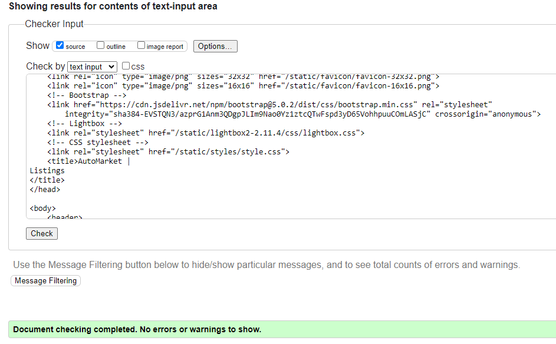

Go back to [README.md](/README.md)

# Testing
- [Code Validation](#code-validation)
    - [HTML](#html)
    - [CSS](#css)
    - [JavaScript](#JavaScript)
    - [Python](#python)
- [Responsiveness](#Responsiveness)
- [Browser Compatibility](#browser-compatibility)
- [Lighthouse](#Lighthouse)
- [Manual Testing](#manual-testing)
- [User Story Testing](#user-story-testing)

## Code Validation
### HTML
|Page|Validator|Result|
| --- | --- | --- |
| Home | | <mark>PASS<mark> |
| Listings | | <mark>PASS<mark> |
| Single Listing | | <mark>PASS<mark> |
| Create And Edit Listing | | <mark>PASS<mark> |
| My Profile | | <mark>PASS<mark> |
| My Listings | | <mark>PASS<mark> |
| My Favourites | | <mark>PASS<mark> |
| User Account | | <mark>PASS<mark> |
| User Listings | | <mark>PASS<mark> |
| Edit Profile | | <mark>PASS<mark> |
| Delete Profile Conf| | <mark>PASS<mark> |
| Profile Deleted | | <mark>PASS<mark> |
| Delete Listing Conf | | <mark>PASS<mark> |
| Remove Favourite | | <mark>PASS<mark> |
| Log In | | <mark>PASS<mark> |
| Sign Up | | <mark>PASS<mark> |
| Sign Out Conf | | <mark>PASS<mark> |
| Reset Password Enter email | | <mark>PASS<mark> |
| Reset Password email sent | | <mark>PASS<mark> |
| Reset Password Enter password | | <mark>PASS<mark> |
| Reset Password Complete | | <mark>PASS<mark> |
| Error pages | | <mark>PASS<mark> |

### CSS
### JavaScript
1. listing_form.js <mark>PASS<mark> 

2. search.js <mark>PASS<mark>

The initial test showed variable not declared. This was fixed.

### Python
1. Api app
- serializers.py <mark>PASS<mark>

- urls.py <mark>PASS<mark>

- views.py <mark>PASS<mark>

2. Automarket app
- settings.py <mark>PASS<mark> 

(line too long is part of django standart settings file)

- urls.py <mark>PASS<mark>

- views.py <mark>PASS<mark>

3. Listings
- admin.py <mark>PASS<mark>

- cars.py <mark>PASS<mark>

- choices.py <mark>PASS<mark>

- forms.py <mark>PASS<mark>

- models.py <mark>PASS<mark>

- urls.py <mark>PASS<mark>

- url_helpers.py <mark>PASS<mark>

- utils.py <mark>PASS<mark>

- views.py <mark>PASS<mark>

4. Users
- admin.py <mark>PASS<mark>

- apps.py <mark>PASS<mark>

- emails.py <mark>PASS<mark> 

(there is a warning for line too long, however if amended the email sent to the user does not display correct. This is a string and does not affect the code.)

- forms.py <mark>PASS<mark>

- models.py <mark>PASS<mark>

- urls.py <mark>PASS<mark>

- signals.py <mark>PASS<mark>

- views.py <mark>PASS<mark>

